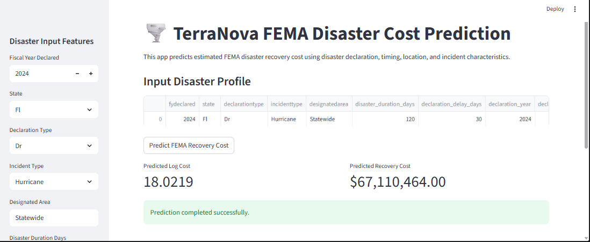
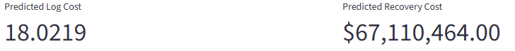
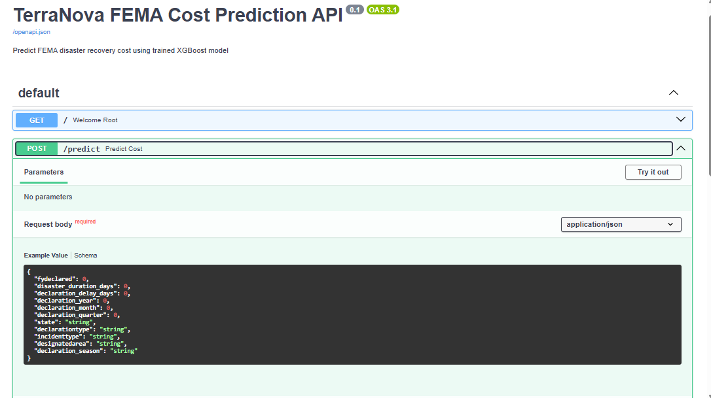

# 🌪️ TerraNova FEMA Disaster Recovery Cost Prediction

## 🎯 Overview

TerraNova is an end-to-end machine learning project that forecasts FEMA disaster recovery costs using historical disaster declarations and disaster characteristics available during the early stages of emergency response.

Unlike many forecasting models that rely on post-disaster funding information, TerraNova intentionally avoids target leakage by using only features that would realistically be available before recovery funding decisions are made.

The project demonstrates a complete production-ready machine learning workflow—from exploratory data analysis and preprocessing to feature engineering, model development, evaluation, and deployment using FastAPI and Streamlit.

### Key Highlights

- ✅ Disaster Recovery Cost Forecasting
- ✅ Leakage-Aware Feature Engineering
- ✅ End-to-End Machine Learning Pipeline
- ✅ Model Comparison (Linear Regression, Random Forest, XGBoost)
- ✅ FastAPI REST API
- ✅ Interactive Streamlit Dashboard
- ✅ Production-Ready Project Structure

---

# 📊 Project Scope

| Metric | Value |
|---------|-------|
| **Industry** | Emergency Management |
| **Domain** | Disaster Recovery |
| **Data Source** | FEMA OpenFEMA |
| **Records** | ~4,900 Disaster Declarations |
| **Geographic Coverage** | United States |
| **Target Variable** | log_totalobligated |
| **Deployment** | FastAPI + Streamlit |
| **Best Model** | XGBoost |

---

# 🏢 Business Context

## The Challenge

Estimating disaster recovery costs during the early stages of an emergency is difficult because most financial information becomes available only after FEMA funding decisions have already been made.

Many predictive models achieve excellent performance by using variables that would not exist when predictions are actually needed, resulting in target leakage and unrealistic performance.

### Key Challenges

- Uncertain recovery funding requirements
- Limited information available at declaration time
- Inefficient emergency resource allocation
- Increasing disaster frequency and severity
- Need for reliable early-stage forecasting

---

## The Solution

TerraNova predicts FEMA disaster recovery costs using only declaration-stage information, including:

- Fiscal year declared
- State
- Declaration type
- Incident type
- Designated area
- Declaration timing
- Temporal disaster characteristics

This allows emergency planners to estimate recovery costs before funding information becomes available.

---

# 📈 Business Impact

Accurate early-stage cost prediction can help emergency management agencies:

- Estimate likely recovery costs earlier
- Improve emergency budgeting
- Prioritize high-impact disasters
- Support federal and state recovery planning
- Allocate emergency resources more efficiently

---

# 🏗️ Feature Engineering

The project emphasizes leakage-aware feature engineering by using only information available during disaster declaration.

### Temporal Features

- Declaration Delay
- Declaration Year
- Declaration Month
- Declaration Quarter
- Declaration Season
- Fiscal Year Declared

### Geographic Features

- State
- Designated Area

### Disaster Features

- Incident Type
- Declaration Type

### Experimental Features

Several aggregation and funding-based features were engineered during experimentation.

Examples included:

- Historical declaration counts
- Public Assistance project statistics
- Individual Assistance indicators
- Disaster summary metrics

These features were useful during experimentation but were excluded from the final production model if they relied on future information or introduced target leakage.

---

# 🏗️ System Architecture

```text
Raw FEMA Data
        │
        ▼
Exploratory Data Analysis
        │
        ▼
Data Preprocessing
        │
        ▼
Feature Engineering
        │
        ▼
Train/Test Split
        │
        ▼
Model Training
        │
        ▼
Model Evaluation
        │
        ▼
FastAPI Deployment
        │
        ▼
Streamlit Dashboard
```

---

# 🤖 Model Development

## Models Evaluated

- Linear Regression
- Random Forest Regressor
- XGBoost Regressor

The objective was to predict FEMA recovery costs while avoiding target leakage and preserving real-world prediction capability.

### Target Variable

```
log_totalobligated
```

Because disaster recovery costs are highly right-skewed, a logarithmic transformation was applied before model training.

---

# 🤖 Model Performance

| Model | RMSE (Log Scale) | R² Score | MAE (Original Scale) |
|--------|------------------|----------|----------------------|
| Linear Regression | **5.3837** | **0.5024** | **$35.32 Million** |
| Random Forest | **3.1050** | **0.8345** | **$64.14 Million** |
| XGBoost | **3.0487** | **0.8404** | **$66.97 Million** |

---

# 🏆 Best Model — XGBoost

### Performance Summary

- **RMSE (Log):** 3.0487
- **R² Score:** 0.8404
- **Target Variable:** log_totalobligated
- **Deployment:** FastAPI + Streamlit

---

## Model Insights

The final XGBoost model explains approximately **84% of the variation in FEMA disaster recovery costs** while relying only on declaration-stage information.

Although earlier experiments achieved slightly higher performance using funding-related variables, these features were intentionally removed because they introduced target leakage and would not be available during real-world prediction.

This makes the final model more realistic, interpretable, and suitable for operational deployment.

---

# 🔍 Feature Importance

The most influential features included:

- Declaration Year
- # 🌪️ TerraNova FEMA Disaster Recovery Cost Prediction

## 🎯 Overview

TerraNova is an end-to-end machine learning project that forecasts FEMA disaster recovery costs using historical disaster declarations and disaster characteristics available during the early stages of emergency response.

Unlike many forecasting models that rely on post-disaster funding information, TerraNova intentionally avoids target leakage by using only features that would realistically be available before recovery funding decisions are made.

The project demonstrates a complete production-ready machine learning workflow—from exploratory data analysis and preprocessing to feature engineering, model development, evaluation, and deployment using FastAPI and Streamlit.

### Key Highlights

- ✅ Disaster Recovery Cost Forecasting
- ✅ Leakage-Aware Feature Engineering
- ✅ End-to-End Machine Learning Pipeline
- ✅ Model Comparison (Linear Regression, Random Forest, XGBoost)
- ✅ FastAPI REST API
- ✅ Interactive Streamlit Dashboard
- ✅ Production-Ready Project Structure

---

# 📊 Project Scope

| Metric | Value |
|---------|-------|
| **Industry** | Emergency Management |
| **Domain** | Disaster Recovery |
| **Data Source** | FEMA OpenFEMA |
| **Records** | ~4,900 Disaster Declarations |
| **Geographic Coverage** | United States |
| **Target Variable** | log_totalobligated |
| **Deployment** | FastAPI + Streamlit |
| **Best Model** | XGBoost |

---

# 🏢 Business Context

## The Challenge

Estimating disaster recovery costs during the early stages of an emergency is difficult because most financial information becomes available only after FEMA funding decisions have already been made.

Many predictive models achieve excellent performance by using variables that would not exist when predictions are actually needed, resulting in target leakage and unrealistic performance.

### Key Challenges

- Uncertain recovery funding requirements
- Limited information available at declaration time
- Inefficient emergency resource allocation
- Increasing disaster frequency and severity
- Need for reliable early-stage forecasting

---

## The Solution

TerraNova predicts FEMA disaster recovery costs using only declaration-stage information, including:

- Fiscal year declared
- State
- Declaration type
- Incident type
- Designated area
- Declaration timing
- Temporal disaster characteristics

This allows emergency planners to estimate recovery costs before funding information becomes available.

---

# 📈 Business Impact

Accurate early-stage cost prediction can help emergency management agencies:

- Estimate likely recovery costs earlier
- Improve emergency budgeting
- Prioritize high-impact disasters
- Support federal and state recovery planning
- Allocate emergency resources more efficiently

---

# 🏗️ Feature Engineering

The project emphasizes leakage-aware feature engineering by using only information available during disaster declaration.

### Temporal Features

- Declaration Delay
- Declaration Year
- Declaration Month
- Declaration Quarter
- Declaration Season
- Fiscal Year Declared

### Geographic Features

- State
- Designated Area

### Disaster Features

- Incident Type
- Declaration Type

### Experimental Features

Several aggregation and funding-based features were engineered during experimentation.

Examples included:

- Historical declaration counts
- Public Assistance project statistics
- Individual Assistance indicators
- Disaster summary metrics

These features were useful during experimentation but were excluded from the final production model if they relied on future information or introduced target leakage.

---

# 🏗️ System Architecture

```text
Raw FEMA Data
        │
        ▼
Exploratory Data Analysis
        │
        ▼
Data Preprocessing
        │
        ▼
Feature Engineering
        │
        ▼
Train/Test Split
        │
        ▼
Model Training
        │
        ▼
Model Evaluation
        │
        ▼
FastAPI Deployment
        │
        ▼
Streamlit Dashboard
```

---

# 🤖 Model Development

## Models Evaluated

- Linear Regression
- Random Forest Regressor
- XGBoost Regressor

The objective was to predict FEMA recovery costs while avoiding target leakage and preserving real-world prediction capability.

### Target Variable

```
log_totalobligated
```

Because disaster recovery costs are highly right-skewed, a logarithmic transformation was applied before model training.

---

# 🤖 Model Performance

| Model | RMSE (Log Scale) | R² Score | MAE (Original Scale) |
|--------|------------------|----------|----------------------|
| Linear Regression | **5.3837** | **0.5024** | **$35.32 Billion** |
| Random Forest | **3.1050** | **0.8345** | **$64.14 Million** |
| XGBoost | **3.0487** | **0.8404** | **$66.97 Million** |

---

# 🏆 Best Model — XGBoost

### Performance Summary

- **RMSE (Log):** 3.0487
- **R² Score:** 0.8404
- **Target Variable:** log_totalobligated
- **Deployment:** FastAPI + Streamlit

---

## Model Insights

The final XGBoost model explains approximately **84% of the variation in FEMA disaster recovery costs** while relying only on declaration-stage information.

Although earlier experiments achieved slightly higher performance using funding-related variables, these features were intentionally removed because they introduced target leakage and would not be available during real-world prediction.

This makes the final model more realistic, interpretable, and suitable for operational deployment.

---

# 🔍 Feature Importance

The most influential features included:

- Declaration Year
- Average Declaration Delay
- Declaration Delay
- Declaration Type
- Fiscal Year Declared
- Incident Type
- State
- Designated Area

These findings suggest that disaster timing and declaration characteristics provide strong predictive signals even without using post-disaster funding information.

---

# 📸 Application Screenshots

## Streamlit Dashboard

```markdown

```

## Prediction Example

```markdown

```

## FastAPI Swagger Documentation

```markdown

```

---

# 🚀 API Endpoint

## POST /predict

### Example Request

```json
{
    "fydeclared": 2024,
    "state": "FL",
    "declarationtype": "DR",
    "incidenttype": "Hurricane",
    "designatedarea": "Statewide",
    "declaration_delay_days": 30,
    "declaration_year": 2024,
    "declaration_month": 9,
    "declaration_quarter": 3,
    "declaration_season": "Autumn"
}
```

### Example Response

```json
{
    "predicted_log_cost": 18.02,
    "predicted_recovery_cost": 67110464
}
```

---

# 📁 Project Structure

```text
TerraNova_project/
│
├── assets/
│   ├── streamlit_dashboard.png
│   ├── prediction_example.png
│   └── swagger_api.png
│
├── data/
│   ├── raw/
│   │   ├── declarations.csv
│   │   ├── public_assistance.csv
│   │   └── disaster_summaries.csv
│   │
│   └── processed/
│       └── features_fema.csv
│
├── models/
│   └── fema_cost_model.pkl
│
├── notebooks/
│   ├── 01_eda.ipynb
│   ├── 02_preprocessing.ipynb
│   ├── 03_feature_engineering.ipynb
│   └── 04_modeling.ipynb
│
├── src/
│   ├── ingestion/
│   ├── preprocessing/
│   ├── features/
│   ├── models/
│   ├── api/
│   └── config.py
│
├── streamlit_app/
│   └── app.py
│
├── requirements.txt
├── .gitignore
└── README.md
```

---

# 🛠️ Technology Stack

| Category | Technologies |
|-----------|--------------|
| Machine Learning | Scikit-Learn, XGBoost |
| Data Processing | Pandas, NumPy |
| Visualization | Matplotlib, Seaborn |
| API Development | FastAPI |
| Dashboard | Streamlit |
| Model Serialization | Joblib |
| Development Environment | VS Code |
| Version Control | Git, GitHub |

---

# 🚀 Quick Start

## Clone Repository

```bash
git clone https://github.com/Alpha-rammy/TerraNova_project.git
cd TerraNova_project
```

## Create Virtual Environment

```bash
python -m venv venv
```

### Windows

```bash
venv\Scripts\activate
```

### macOS/Linux

```bash
source venv/bin/activate
```

## Install Requirements

```bash
pip install -r requirements.txt
```

## Run FastAPI

```bash
uvicorn src.api.main:app --reload
```

Visit:

```
http://127.0.0.1:8000/docs
```

## Run Streamlit

```bash
streamlit run streamlit_app/app.py
```

---

# 📌 Key Findings

- XGBoost achieved the strongest predictive performance.
- Disaster recovery costs are highly right-skewed.
- Log transformation substantially improved model stability.
- Temporal declaration characteristics were among the strongest predictors.
- Tree-based ensemble methods outperformed linear regression.
- Removing leakage features resulted in a more realistic and deployable model.
- The final XGBoost model explains approximately **84% of the variability** in FEMA recovery costs using declaration-stage information only.

---

# 🔮 Future Improvements

Potential future enhancements include:

- Time-based cross-validation
- Hyperparameter optimization with Optuna
- SHAP explainability
- MLflow experiment tracking
- Docker containerization
- Cloud deployment (Azure/AWS)
- CI/CD using GitHub Actions

---


- Declaration Delay
- Average Declaration Delay
- Declaration Type
- Fiscal Year Declared
- Incident Type
- State
- Designated Area

These findings suggest that disaster timing and declaration characteristics provide strong predictive signals even without using post-disaster funding information.

---

# 📸 Application Screenshots

## Streamlit Dashboard

```markdown

```

## Prediction Example

```markdown

```

## FastAPI Swagger Documentation

```markdown

```

---

# 🚀 API Endpoint

## POST /predict

### Example Request

```json
{
    "fydeclared": 2024,
    "state": "FL",
    "declarationtype": "DR",
    "incidenttype": "Hurricane",
    "designatedarea": "Statewide",
    "declaration_delay_days": 30,
    "declaration_year": 2024,
    "declaration_month": 9,
    "declaration_quarter": 3,
    "declaration_season": "Autumn"
}
```

### Example Response

```json
{
    "predicted_log_cost": 18.02,
    "predicted_recovery_cost": 67110464
}
```

---

# 📁 Project Structure

```text
TerraNova_project/
│
├── assets/
│   ├── streamlit_dashboard.png
│   ├── prediction_example.png
│   └── swagger_api.png
│
├── data/
│   ├── raw/
│   │   ├── declarations.csv
│   │   ├── public_assistance.csv
│   │   └── disaster_summaries.csv
│   │
│   └── processed/
│       └── features_fema.csv
│
├── models/
│   └── fema_cost_model.pkl
│
├── notebooks/
│   ├── 01_eda.ipynb
│   ├── 02_preprocessing.ipynb
│   ├── 03_feature_engineering.ipynb
│   └── 04_modeling.ipynb
│
├── src/
│   ├── ingestion/
│   ├── preprocessing/
│   ├── features/
│   ├── models/
│   ├── api/
│   └── config.py
│
├── streamlit_app/
│   └── app.py
│
├── requirements.txt
├── .gitignore
└── README.md
```

---

# 🛠️ Technology Stack

| Category | Technologies |
|-----------|--------------|
| Machine Learning | Scikit-Learn, XGBoost |
| Data Processing | Pandas, NumPy |
| Visualization | Matplotlib, Seaborn |
| API Development | FastAPI |
| Dashboard | Streamlit |
| Model Serialization | Joblib |
| Development Environment | VS Code |
| Version Control | Git, GitHub |

---

# 🚀 Quick Start

## Clone Repository

```bash
git clone https://github.com/Alpha-rammy/TerraNova_project.git
cd TerraNova_project
```

## Create Virtual Environment

```bash
python -m venv venv
```

### Windows

```bash
venv\Scripts\activate
```

### macOS/Linux

```bash
source venv/bin/activate
```

## Install Requirements

```bash
pip install -r requirements.txt
```

## Run FastAPI

```bash
uvicorn src.api.main:app --reload
```

Visit:

```
http://127.0.0.1:8000/docs
```

## Run Streamlit

```bash
streamlit run streamlit_app/app.py
```

---

# 📌 Key Findings

- XGBoost achieved the strongest predictive performance.
- Disaster recovery costs are highly right-skewed.
- Log transformation substantially improved model stability.
- Temporal declaration characteristics were among the strongest predictors.
- Tree-based ensemble methods outperformed linear regression.
- Removing leakage features resulted in a more realistic and deployable model.
- The final XGBoost model explains approximately **84% of the variability** in FEMA recovery costs using declaration-stage information only.

---

# 🔮 Future Improvements

Potential future enhancements include:

- Time-based cross-validation
- Hyperparameter optimization with Optuna
- SHAP explainability
- MLflow experiment tracking
- Docker containerization
- Cloud deployment (Azure/AWS)
- CI/CD using GitHub Actions

---

# 👨‍💻 Author

**Ransom Chukwu**

MD | Master of Public Health (MPH)

Data Scientist | Machine Learning | Health Informatics | Public Health Analytics

GitHub: https://github.com/Alpha-rammy