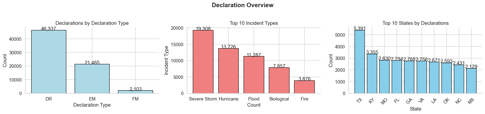
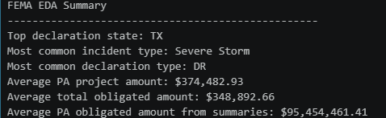
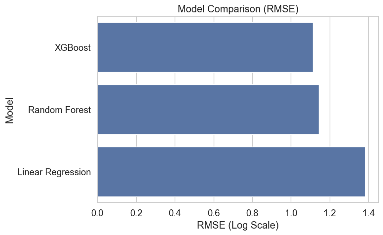
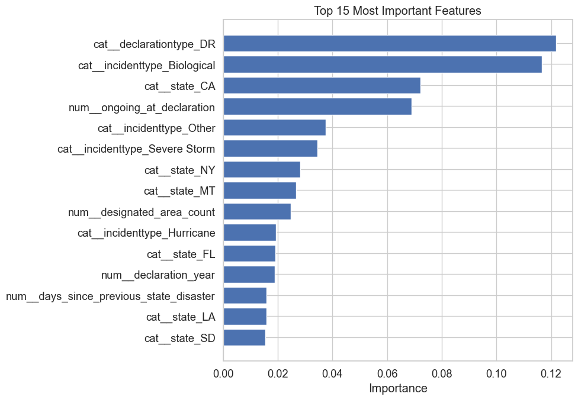
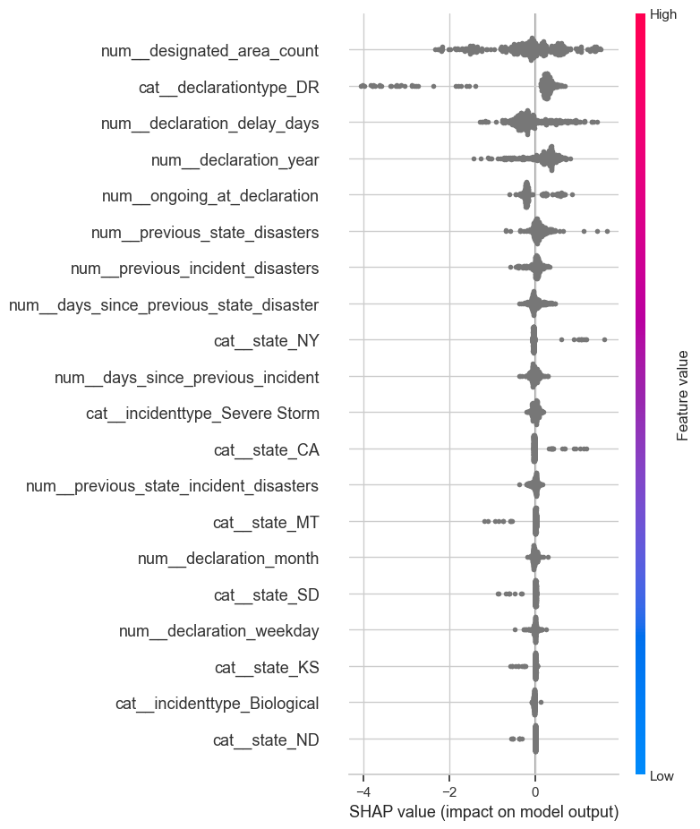
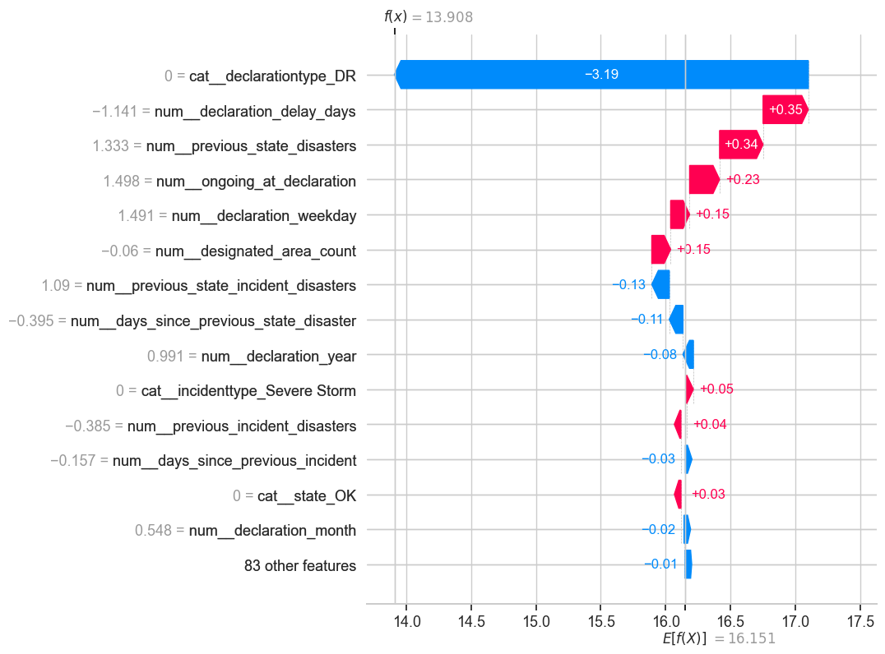

# TerraNova Disaster Cost Recovery Forecasting

## Predicting Federal Disaster Recovery Costs Using Early Disaster Declaration Information

---

# Project Overview

Natural disasters such as hurricanes, floods, wildfires, and severe storms often require significant financial support for response and recovery. However, estimating recovery costs immediately after a disaster declaration is challenging because detailed damage assessments and funding applications can take weeks or months to complete.

This project develops a machine learning model that predicts the final federal disaster recovery cost using only information available at the time of disaster declaration. The model provides an early estimate of recovery costs to support emergency planning, budgeting, and resource allocation before the formal recovery process begins.

Unlike many disaster recovery models, this project deliberately excludes Public Assistance funding information from the predictor variables to prevent target leakage. Public Assistance data is used only to calculate the modelling target.

---

# Business Problem

Emergency management agencies must make critical decisions immediately after a disaster declaration, often before detailed project assessments and funding requests are available.

Without an early estimate of recovery costs, decision-makers may struggle to:

- Allocate emergency resources effectively.
- Plan recovery budgets.
- Prioritise high-impact disasters.
- Support strategic decision-making during disaster response.

This project addresses that challenge by providing an early prediction of disaster recovery costs using only declaration-stage information.

---

# Project Objective

The objective of this project is to build an interpretable machine learning model that predicts the final federal disaster recovery cost immediately after a disaster declaration.

The project focuses on:

- Using only declaration-stage information.
- Preventing target leakage.
- Producing an accurate and explainable forecasting model.
- Deploying the trained model using FastAPI.

---

# Dataset

This project uses publicly available FEMA disaster datasets.

### Disaster Declarations

Used to engineer the predictor variables.

Examples include:

- State
- Disaster type
- Declaration type
- Declaration date
- Designated disaster areas
- Historical disaster information

### Public Assistance

Used only to calculate the modelling target.

- Total Federal Recovery Cost
- Log-transformed Recovery Cost

No funding variables were used as model predictors.

### Disaster Summaries

Used for exploratory analysis only and excluded from model training.

---

# Machine Learning Workflow

```text
Data Collection
      │
      ▼
Data Cleaning
      │
      ▼
Feature Engineering
      │
      ▼
Model Training
      │
      ▼
Model Evaluation
      │
      ▼
Model Explainability
      │
      ▼
FastAPI Deployment
```

---

# Project Structure

```text
TerraNova_Project/
│
├── data/
│   ├── raw/
│   └── processed/
│
├── models/
│   ├── terranova_disaster_cost_model.pkl
│   └── feature_columns.pkl
│
├── notebooks/
│   ├── 01_eda.ipynb
│   ├── 02_preprocessing.ipynb
│   ├── 03_feature_engineering.ipynb
│   ├── 04_modeling.ipynb
│   └── 05_explainability.ipynb
│
├── reports/
│
├── src/
│   ├── api/
│   ├── ingestion/
│   ├── preprocessing/
│   ├── features/
│   └── models/
│
├── requirements.txt
└── README.md
```

---

# Technologies Used

## Programming

- Python

## Data Processing

- Pandas
- NumPy

## Machine Learning

- Scikit-learn
- XGBoost

## Explainability

- SHAP

## Visualisation

- Matplotlib
- Seaborn

## Deployment

- FastAPI
- Uvicorn

---

# Exploratory Data Analysis

The exploratory analysis examined disaster declaration trends, seasonal patterns and recovery cost distributions before model development.

### Declaration Overview



### Exploratory Data Analysis Summary



---

# Feature Engineering

Feature engineering focused on creating predictors that would realistically be available immediately after a disaster declaration.

The engineered features include:

### Temporal Features

- Declaration delay
- Declaration year
- Declaration month
- Declaration weekday
- Declaration season

### Geographic Features

- State
- Number of designated disaster areas

### Historical Features

- Previous disasters in the state
- Previous disasters of the same incident type
- Previous state-incident disasters
- Days since previous disaster

### Operational Feature

- Ongoing disaster indicator

---

# Machine Learning Models

Three regression models were developed and compared.

| Model | Purpose |
|-------|----------|
| Linear Regression | Baseline |
| Random Forest | Ensemble Model |
| XGBoost | Gradient Boosting |

---

# Model Performance

Models were evaluated using:

- RMSE
- MAE
- R² Score

| Model | RMSE | R² |
|-------|------:|------:|
| Linear Regression | 1.383 | 0.516 |
| Random Forest | 1.125 | 0.679 |
| XGBoost | **1.112** | **0.688** |

The XGBoost model achieved the best overall performance and was selected as the final production model.

### Model Comparison



---

# Model Explainability

To improve transparency, the final model was interpreted using Feature Importance and SHAP.

## Feature Importance



The feature importance plot highlights the declaration-stage variables that contributed most to recovery cost predictions.

---

## SHAP Summary Plot



The SHAP summary plot provides a global explanation of how each feature influences model predictions.

---

## SHAP Waterfall Plot



The SHAP waterfall plot explains an individual prediction by showing how each feature increases or decreases the estimated recovery cost.

---

# Business Impact

This model provides an early estimate of disaster recovery costs to support:

- Disaster response planning
- Resource allocation
- Recovery budgeting
- Financial risk assessment
- Evidence-based emergency management

---

# FastAPI Deployment

The trained XGBoost model was deployed using FastAPI to provide real-time disaster recovery cost predictions.

### Sample Prediction Response


---

# Installation

Clone the repository.

```bash
git clone https://github.com/Alpha-rammy/TerraNova_Project.git
```

Move into the project folder.

```bash
cd TerraNova_Project
```

Create a virtual environment.

```bash
python -m venv venv
```

Activate the environment.

### Windows

```bash
venv\Scripts\activate
```

### macOS/Linux

```bash
source venv/bin/activate
```

Install dependencies.

```bash
pip install -r requirements.txt
```

---

# Running the Project

Run the notebooks in order:

1. 01_eda.ipynb
2. 02_preprocessing.ipynb
3. 03_feature_engineering.ipynb
4. 04_modeling.ipynb
5. 05_explainability.ipynb

Launch the API.

```bash
uvicorn src.api.main:app --reload
```

Open:

```text
http://127.0.0.1:8000/docs
```

---

# Future Improvements

Potential enhancements include:

- Weather and climate data integration
- Satellite imagery
- Socioeconomic indicators
- Hyperparameter optimisation
- Cloud deployment (Azure or AWS)
- Interactive dashboard
- Automated model retraining

---

# Key Skills Demonstrated

- Data Cleaning
- Exploratory Data Analysis
- Feature Engineering
- Regression Modeling
- Time-Aware Train-Test Split
- Model Evaluation
- Explainable AI (SHAP)
- FastAPI Deployment
- Git & GitHub

---

# Author

**Ransom Chukwu**

Medical Doctor | Public Health Professional | Data Scientist

Passionate about applying machine learning and analytics to support evidence-based decision-making in healthcare, disaster management and public sector operations.

---

# Acknowledgements

This project uses publicly available disaster data provided by the Federal Emergency Management Agency (FEMA). The data was used solely for educational and portfolio purposes.